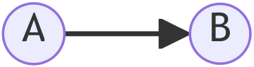

---
ospool:
  path: htc_workloads/automated_workflows/dagman-simple-example.md
---

# Simple Example of a DAGMan Workflow

## Overview

In this guide:

1. [Introduction](#1-introduction)
2. [Structure of the DAG](#2-structure-of-the-dag)
3. [The Minimal DAG Input File](#3-the-minimal-dag-input-file)
4. [The Submit Files](#4-the-submit-files)
5. [Running the Simple DAG](#5-running-the-simple-dag)

For the full details on various DAGMan features, see the HTCondor manual pages: 

* [DAGMan Manual Page](https://htcondor.readthedocs.io/en/latest/automated-workflows/index.html)

## 1. Introduction

Consider the case of two HTCondor jobs that use the submit files `A.sub` and `B.sub`.
Let's say that `A.sub` generates an output file (`output.txt`) that `B.sub` will analyze.
To run this workflow manually, we would

  1. Submit the first HTCondor job with `condor_submit A.sub`.
  2. Wait for the first HTCondor job to complete successfully.
  3. Submit the second HTCondor job with `condor_submit B.sub`.

If the first HTCondor job using `A.sub` is fairly short, then manually running this workflow is not a big deal. 
But if the first HTCondor job takes a long time to complete (maybe takes several hours to run, or has to wait for special resources), 
this can be very inconvenient.
Instead, we can use DAGMan to automatically submit `B.sub` once the first HTCondor job using `A.sub` has completed successfully.
This guide walks through the process of creating such a DAGMan workflow.

## 2. Structure of the DAG

In this scenario, our workflow could be described as a DAG consisting of two nodes (`A.sub` and `B.sub`) connected by a single edge (`output.txt`).
To represent this relationship, we will define nodes `A` and `B` - corresponding to `A.sub` and `B.sub`, respectively - and connect them with a line pointing from `A` and `B`, like in this figure:




In order to use DAGMan to run this workflow, we need to communicate this structure to DAGMan via the `.dag` input file.

## 3. The Minimal DAG Input File

Let's call the input file `simple.dag`.
At minimum, the contents of the `simple.dag` input file are

```
# simple.dag

# Define the DAG jobs
JOB A A.sub
JOB B B.sub

# Define the connections
PARENT A CHILD B
```

In a DAGMan input file, a node is defined using the `JOB` keyword, followed by the name of the node and the name of the corresponding submit file.
In this case, we have created a node named `A` and instructed DAGMan to use the submit file `A.sub` for executing that node.
We have similarly created node `B` and instructed DAGMan to use the submit file `B.sub`. 
(While there is no requirement that the name of the node match the name of the corresponding submit file, it is convenient to use a consistent naming scheme.)

To connect the nodes, we use the `PARENT .. CHILD ..` syntax. 
Since node `B` requires that node `A` has completed successfully, we say that node `A` is the `PARENT` while node `B` is the `CHILD`.
Note that we do not need to define *why* node `B` is dependent on node `A`, only that it is.

## 4. The Submit Files

Now let's define simple examples of the submit files `A.sub` and `B.sub`.

### Node A

First, the submit file `A.sub` uses the executable `A.sh`, which will generate the file called `output.txt`.
We have explicitly told HTCondor to transfer back this file by using the `transfer_output_files` command.

```
# A.sub

executable = A.sh

log = A.log
output = A.out
error = A.err

transfer_output_files = output.txt

+JobDurationCategory = "Medium"

request_cpus = 1
request_memory = 1GB
request_disk = 1GB

queue
```

The executable file simply saves the hostname of the machine running the script:

```
#!/bin/bash

# A.sh
hostname > output.txt
```

### Node B

Second, the submit file `B.sub` uses the executable `B.sh` to print a message using the contents of the `output.txt` file generated by `A.sh`.
We have explicitly told HTCondor to transfer `output.txt` as an *input* file for this job, using the `transfer_input_files` command. 
The message we want will be printed to `B.out`.

```
# B.sub

executable = B.sh

log = B.log
output = B.out
error = B.err

transfer_input_files = output.txt

+JobDurationCategory = "Medium"

request_cpus = 1
request_memory = 1GB
request_disk = 1GB

queue
```

The executable file contains the command for printing the desired message:

```
#!/bin/bash

# B.sh
echo "The previous job was executed on the following machine:"
cat output.txt
```

### The directory structure

Based on the contents of `simple.dag`, DAGMan is expecting that the submit files `A.sub` and `B.sub` are in the same directory as `simple.dag`.
The submit files in turn are expecting `A.sh` and `B.sh` be in the same directory as `A.sub` and `B.sub`.
Thus, we have the following directory structure:

```
DAG_simple/
|-- A.sh
|-- A.sub
|-- B.sh
|-- B.sub
|-- simple.dag
```

It is possible to organize each job into its own directory, but for now we will use this simple, flat organization.

## 5. Running the Simple DAG

To run the DAG workflow described by `simple.dag`, we use the HTCondor command `condor_submit_dag`:

```
condor_submit_dag simple.dag
```

The DAGMan utility will then parse the input file and generate an assortment of related files that it will use for monitoring and managing your workflow.
Here is the output of running the above command:

```
[user@ap40 DAG_simple]$ condor_submit_dag simple.dag

Loading classad userMap 'checkpoint_destination_map' ts=1699037029 from /etc/condor/checkpoint-destination-mapfile
-----------------------------------------------------------------------
File for submitting this DAG to HTCondor           : simple.dag.condor.sub
Log of DAGMan debugging messages                 : simple.dag.dagman.out
Log of HTCondor library output                     : simple.dag.lib.out
Log of HTCondor library error messages             : simple.dag.lib.err
Log of the life of condor_dagman itself          : simple.dag.dagman.log

Submitting job(s).
1 job(s) submitted to cluster 530705.
-----------------------------------------------------------------------
```

The output shows the list of standard files that are created with every DAG submission along with brief descriptions. 
A couple of additional files will be created during the lifetime of the DAG.

## 6. Monitoring the Simple DAG

You can see the status of the DAG in your queue just like any other HTCondor job submission.

