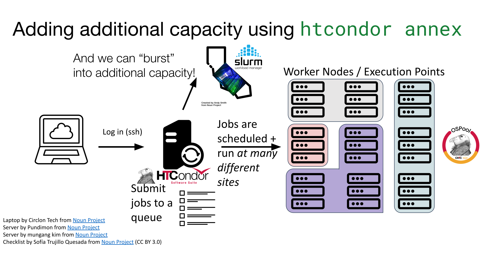

---
ospool:
  path: htc_workloads/specific_resource/annex.md
---

# Expanding the OSPool with HPC and Cloud Resources Using HTCondor Annex

## Overview

The **HTCondor Annex** feature allows researchers to temporarily add computing resources they own (or have access to) to the **Open Science Pool (OSPool)** from external systems such as:

* High Performance Computing (HPC) clusters
* Cloud environments
* Institutional clusters

Instead of submitting jobs directly to those systems, **Annex enables them to join the OSPool as temporary execution points**. Once attached, they pull targeted jobs from **your** OSPool queue just like any other execution node.

This approach enables:

* Seamless scaling when large workloads arise
* Access to specialized resources (GPUs, large memory nodes)
* Integration of HPC and HTC workflows
* Reduced queue times for large campaigns
* Orchestration of workflows spanning multiple cyberinfrastructures (NAIRR, ACCESS, campus clusters, cloud, etc)

In essence, **Annex turns external compute systems into temporary OSPool resources**.

# When Should You Use Annex?

Annex is useful when:

* You have **access to external HPC allocations** (e.g., ACCESS resources like Purdue's Anvil or SDSC's Expanse)
* Your project needs **more resources than the OSPool can currently provide**
* You want to **burst large workflows** across additional infrastructure
* Your jobs require **specialized hardware** (GPUs, high memory nodes)

Typical use cases include:

* Large ML training or inference campaigns
* Large genome assemblies
* Parameter sweeps and ensemble simulations


# How HTCondor Annex Works

HTCondor Annex connects external resources to your **submit host’s HTCondor pool**.



The process works as follows:

1. You submit jobs to the **OSPool** tagged for execution on a specific annex.
2. You launch an **annex request** targeting an external resource.
3. The annex SSH's into the requested resource and submits a job to create execution points on that system.
4. Those nodes start **HTCondor startd daemons**.
5. The nodes join the OSPool accessible **only to you**.
6. Tagged jobs **match to the annexed EPs**.

When the annex expires, the nodes automatically leave the pool. This workflow allows **transparent scaling** of the pool without modifying your job submission workflow.

# Requirements

Before using HTCondor Annex you must have:

* An **OSPool account**
* A **submit node configured with HTCondor**
* Access to an **external computing resource**

Examples include:

* ACCESS allocations
* University clusters
* Cloud accounts

You must also have **permission to launch jobs on that system**.

**Note**: The HTCondor Annex does not support all ACCESS or NAIRR resources currently. It is designed to work with specific systems that allow SSH access and job launching. Below is a list of currently supported ACCESS/NAIRR resources using the HTCondor Annex:

| Resource Name  | Type            | Partitions Supported                                                                                                | Notes                                                                                                  |
|----------------|-----------------|---------------------------------------------------------------------------------------------------------------------|--------------------------------------------------------------------------------------------------------|
| anvil          | ACCESS          | wholenode<br>wide<br>shared<br>gpu<br>gpu-debug                                                                     |                                                                                                        |
| aws-ec2        | AWS Users       | <instance-type>                                                                                                     | Contact the [OSPool RCFs](mailto:support@osg-htc.org) for additional support with AWS annexes          |
| bridges2       | ACCESS          | RM<br>RM-512<br>RM-shared<br>EM<br>GPU<br>GPU-shared                                                                |                                                                                                        |
| delta          | ACCESS<br>NAIRR | cpu<br>cpu-interactive<br>gpuA100x4<br>gpuA100x4-preempt<br>gpuA100x8<br>gpuA40x4<br>gpuA40x4-preempt<br>gpuMI100x8 
| expanse        | ACCESS<br>NAIRR | compute<br>gpu<br>shared<br>gpu-shared                                                                              |                                                                                                        |
| path-facility  | PATh            | cpu                                                                                                                 | NSF funded projects _may_ be eligible to use the PATh resources                                        |
| perlmutter     | NERSC Users     | regular<br>debug<br>shared                                                                                          | This resource may be available to users with CLI access to NERSC's Perlmutter system.                  |
| spark          | CHTC@UW-Madison | shared<br>int<br>pre                                                                                                | This resource is specific to the [University of Wisconsin-Madison Community](https://chtc.cs.wisc.edu) |

!!! question "Don't see **your** resource listed?"

    We are actively working to expand the list of supported resources for HTCondor Annex. If you have access to an HPC cluster, cloud environment, or other computing resource that you would like to use with the OSPool, please reach out to us at [support@osg-htc.org](mailto:support@osg-htc.org) to discuss potential integration.

# Basic Annex Workflow

Using Annex typically involves three steps:

1. Submit jobs
2. Request an annex
3. Monitor annex resources


## Step 1 — Submit Jobs Normally

Prepare a standard HTCondor submit file.

Example:

```condor
universe = vanilla

executable = run_task.sh

request_cpus = 1
request_memory = 2GB
request_disk = 2GB

log = job.log
output = job.out
error = job.err

queue 10
```

Submit the jobs:

```bash
condor_submit job.sub
```

Your jobs will wait in the queue until workers become available.


## Step 2 — Create an Annex

Next, launch the annex to provision workers. 

The HTCondor annex is best supported using the newer HTCondor Noun-Verb CLI toolkit. This is a more user-friendly interface for managing annexes compared to the older `condor_annex` command. The Noun-Verb CLI provides a more intuitive and streamlined experience for creating and managing annexes, with improved error handling and feedback. The noun-verb CLI is already available on all OSPool submit hosts, so you can start using it right away.

In order to create an annex, you can use the following command:

```bash
htcondor annex create <annex-name> <partition>@<resource-name> \
     --project <id> --login-name <user> --<compute-resource> <int>
```

Example command:

```bash
htcondor annex create catdog_annex gpu@expanse \
     --project BIO0000001 --login-name jane.smith --gpus 4
```

This request:

* launches a **2 execution points** each with **4 GPUs** on the Expanse cluster
* the nodes join the OSPool as `catdog_annex` annex workers
* they pull jobs tagged for `catdog_annex`
* the nodes run until the annex expires (default 4 hours) or you remove it
* charges are billed to the specified project (`BIO0000001` in this example) allocation

You will be prompted to enter your password for the target resource (e.g., Expanse) to authenticate the annex request. You will also likely need to complete a two-factor authentication (2FA) step, such as entering a code from an authenticator app or receiving a code via email, to verify your identity and authorize the annex request.

Additional options allow you to specify:

```
usage: htcondor annex create [-h] [--nodes NODES] [--lifetime LIFETIME] [--project ALLOCATION] [--pool COLLECTOR] [--token_file TOKEN_FILE]
                             [--tmp_dir CONTROL_PATH] [--cpus CPUS] [--mem_mb MEM_MB] [--login-name LOGIN_NAME] [--login-host LOGIN_HOST]
                             [--idle-time SECONDS] [--gpus GPUS] [--gpu-type GPU_TYPE]
```

Once provisioned, the workers will join your HTCondor pool and begin executing jobs.


## Step 3 — Monitor the Annex

You can view annex status using:

```bash
htcondor annex status <annex-name>
```

This shows:

* active annexes
* worker counts
* expiration times

Example output:

```
Annex Name     Workers    Expiration
------------------------------------
my-annex       2         03:59:10
```


### Monitoring Jobs

Standard HTCondor monitoring tools apply:

```bash
condor_q
```

Shows queued and running jobs.

```bash
condor_status
```

Shows available workers, including annex nodes.


# Shutting Down an Annex

You can remove an annex early if needed:

```bash
htcondor annex shutdown <annex-name>
```

This terminates all workers associated with the annex.


# Resource Matching

Annex nodes advertise resources using **ClassAds**, just like normal OSPool nodes.

For example:

```
Cpus = 4
Memory = 16000
HasGPU = True
```

Jobs are matched based on:

* CPU requirements
* memory requirements
* disk
* custom requirements

Example GPU job:

```condor
request_gpus = 1
requirements = (HasGPU == True)
```

Annex nodes that advertise GPUs will run these jobs.


# Best Practices

### Use Reasonable Job Sizes

HTCondor performs best with:

* CPU jobs: 1–4 cores
* memory: 1–16 GB
* runtime: several hours

Extremely large jobs may run better directly on HPC systems.


### Use Many Small Jobs

HTCondor excels at **large numbers of independent tasks**.

Example workloads:

* parameter sweeps
* ensemble simulations
* genome alignments
* machine learning inference batches


### Use Containers

For reproducibility, use **Apptainer containers**.

Example:

```condor
container_image = osdf:///ospool/ap4x/data/<user.name>/my-container.sif
```

You should assume the the annexed resource will not have your software or data, so using containers ensures your jobs run correctly.

### Plan Annex Use Carefully

Annex resources are billed or allocated based on time and resources used. Plan your annex use to minimize costs and maximize throughput. 

Before launching an annex, consider:
* How many workers do you need?
* How long will your jobs run?
* What resources do your jobs require (CPUs, memory, GPUs)?
* What is the cost of using the annexed resources (NAIRR or ACCESS credits)?

# Example Use Case: Large Bioinformatics Workflow

Suppose you want to run a **large genome assembly** which requires **>512 GB or RAM**. For this workflow, you may have POD5 files that can be easily basecalled in parallel on the OSPool GPU capacity. However, the assembly step requires large memory nodes that are not currently available in the OSPool. By using HTCondor Annex, you can provision execution points on an external cluster that has the necessary resources for assembly.

Steps:

1. Submit jobs to OSPool
2. Launch annex with a large-memory node worker
3. Worker begin pulling jobs
4. Entire workload completes
5. Downstream analysis can continue on the OSPool or on the annexed resource

This enables hybrid workflows using both **massively parallelized throughput** and **specialized memory-hungry jobs** without manual scheduling and data transfers between systems.


# Troubleshooting

### Annex does not appear in condor_status

Possible causes:

* provisioning delay
* networking issues
* authentication problems

Check annex status:

```bash
htcondor annex status
```


### Jobs remain idle

Check job requirements:

```bash
condor_q -better-analyze <jobid>
```

This shows why jobs are not matching resources.


# Summary

HTCondor Annex enables dynamic scaling of OSPool workloads by attaching external resources such as HPC clusters and cloud environments.

Key advantages include:

* integration with existing workflows
* dynamic expansion of computing capacity
* ability to run large campaigns without manual scheduling

By combining the **OSPool with annexed resources**, researchers can build scalable distributed workflows that span institutional, national, and cloud computing environments.
