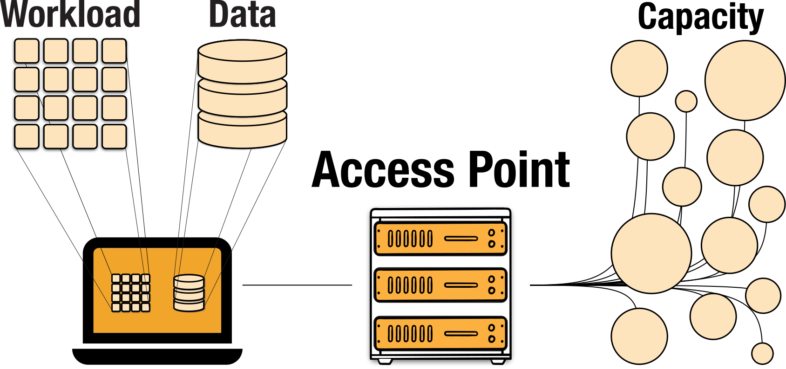

---
ospool:
  path: overview/account_setup/registration-and-login.md
---

## Start Here: Overview of Requesting OSPool Access

The major steps to get started on the OSPool are: 

* apply for access to the OSPool
* meet with a facilitation team member for an short consultation and orientation. 
* register for a specific OSPool Access Point
* log in to your designated Access Point

Each of these is detailed in the guide below. 
Once you've gone through these steps, you should be able to begin running work! 

## Apply for OSPool Access

To start, fill out the interest form on this OSG Portal site: 

[OSPool Consultation Request](https://portal.osg-htc.org/application)

This will send the Research Facilitation team an email. We will be in 
touch to set up an orientation meeting, and confirm if you are joining 
an existing project on the OSPool or starting a new one. 

## Orientation Meeting

The orientation meeting generally takes about 20-30 minutes and is a chance to 
talk about your work, how it will 
fit on the OSPool, and some practical next steps for getting started. 

## Register for an Access Point

Before or during the orientation meeting, you will be prompted to register 
for an account on a specific OSPool Access Point. The current default are
`uw.osg-htc.org` Access Points. 

### Register for `uw.osg-htc.org` Access Points

To register for the `ap40.uw.osg-htc.org` access point, submit an application using the following steps:

1. Visit this account [registration page](https://registry.cilogon.org/registry/co_petitions/start/coef:211). You will be redirected to the CILogon sign in page. Select your institution and use your institutional credentials to login. You will use these credentials later to login so it is important to remember the institution you use at this step.
   
   
      
   
   
   If you have issues signing in using your institutional credentials, contact us at [support@osg-htc.org](mailto:support@osg-htc.org).

2. Once you sign in, you will be redirected to the User Enrollment page. Click "Begin" and enter your name and email address in the following page. In many cases, this information will be automatically populated. If desired, it is possible to manually edit any information automatically filled in. Once you have entered your information, click "SUBMIT".

      

3. After submitting your application, you will receive an email from [registry@cilogon.org](mailto:registry@cilogon.org) to verify your email address. Click the link listed in the email to be redirected to a page confirm your invitation details. Click the "ACCEPT" button to complete this step.

      
   
### Register for `uc.osg-htc.org` Access Points

You can register for OSG Connect Access Points here: 

[OSG Connect Account Registration](https://www.osgconnect.net/signup)

**Only do this if you have been instructed to do so by a Research Computing Facilitator!**

## Account Approval by a Research Computing Facilitator

If a meeting has not already been scheduled with a Research Computing Facilitator, one of the facilitation team will contact you about arranging a short consultation. 

Following the meeting, the Facilitator will approve your account and add your profile to 
any relevant OSG ‘project’ names. Once your account is ready, the Facilitator will email 
you with your account details. 

## Log In

Once you've gone through the steps above, you should have an account on 
on OSPool Access Point! 

Follow the instructions below to learn how to log in to you OSPool Access Point. 

**Accounts for all new users are created on `uw.osg-htc.org` Access Points unless otherwise specified.** 

Log In to <code>uw.osg-htc.org</code> Access Points (e.g., <code>ap40.uw.osg-htc.org</code>)

 
If your account is on the <code>uw.osg-htc.org</code> Access Points (e.g., accounts on <code>ap40.uw.osg-htc.org</code>), follow instructions in this guide for logging in:
<a href="https://portal.osg-htc.org/documentation/overview/account_setup/comanage-access/">Log In to <code>uw.osg-htc.org</code> Access Points</a>

Log In to <code>uc.osg-htc.org</code> Access Points (e.g., <code>ap20.uc.osg-htc.org</code>)

 
If your account is on the <code>uc.osg-htc.org</code> Access Points (e.g., accounts on <code>ap20.uc.osg-htc.org</code>, <code>ap21.uc.osg-htc.org</code>), follow instructions in this guide for logging in:
<a href="https://portal.osg-htc.org/documentation/overview/account_setup/connect-access/">Log In to <code>uc.osg-htc.org</code> Access Points</a>

