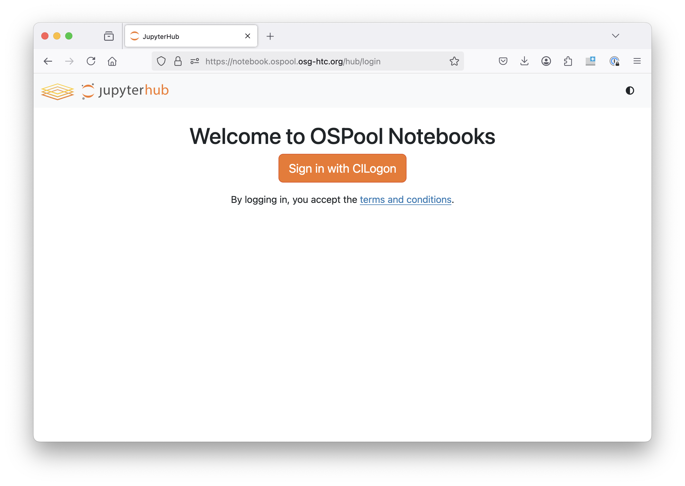
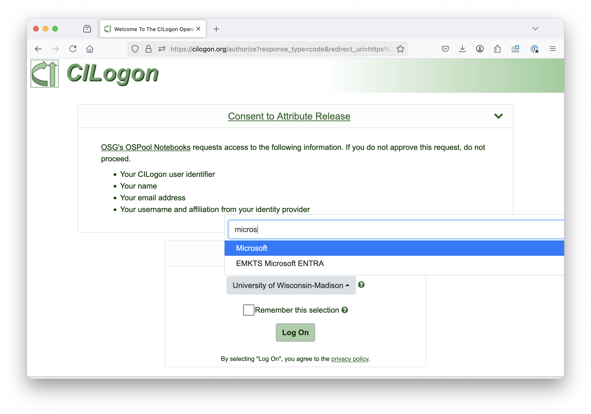
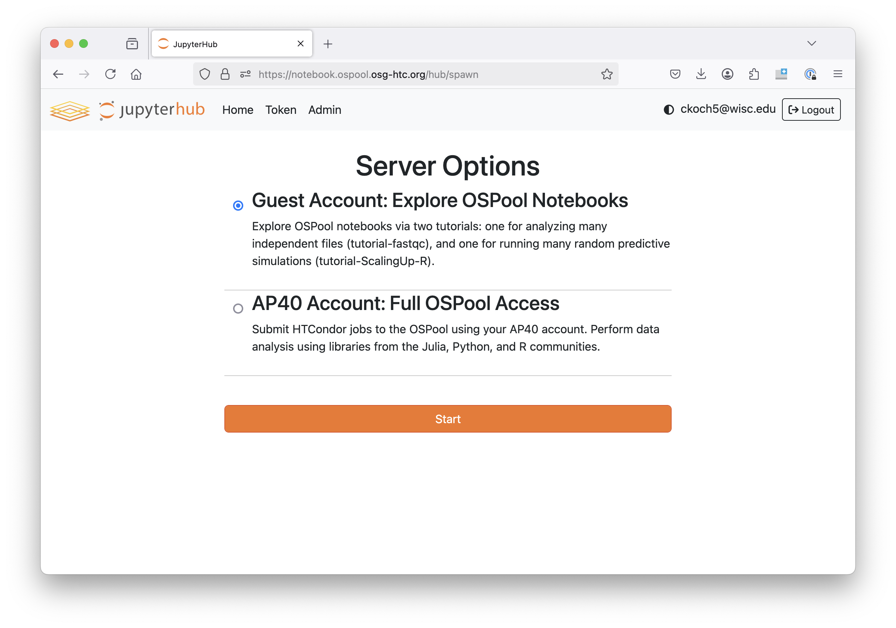
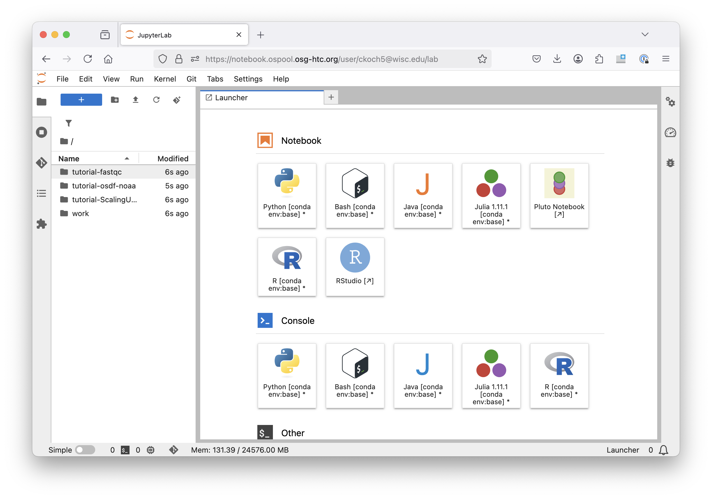
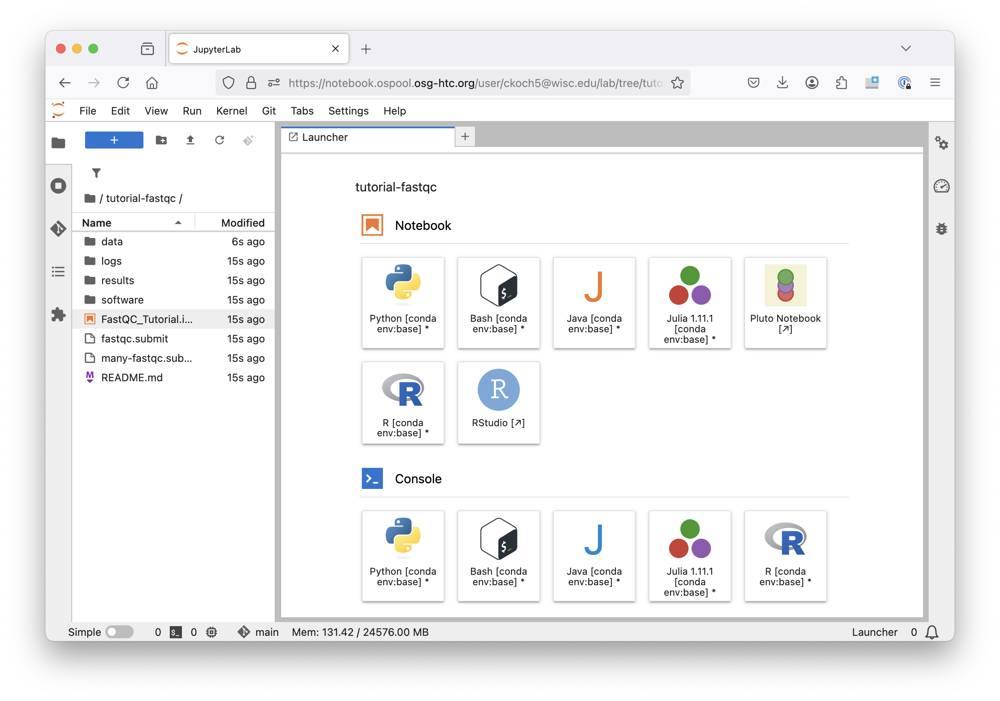
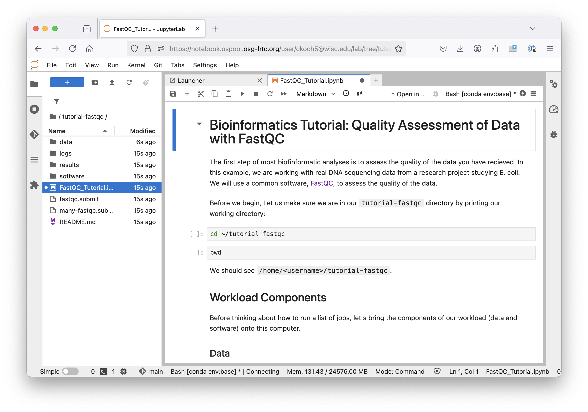

---
ospool:
  path: overview/test-drive-ospool.md
---

Test Drive the Open Science Pool 
====================================

Want to see what it's like to use the OSPool? You can do so with 
an OSPool notebook - and you don't even need an account! 

See a video of this process below: [OSPool Notebook Walkthrough](#ospool-notebook-walkthrough)

1. Go to [OSPool Notebooks](https://osg-htc.org/notebooks)

	

1. Log in with your institutional identity. If it isn't listed, use Google or Microsoft 
(depending on which your institution uses for email) and then use your 
institutional ID to log in. 

	

1. Choose the "Guest notebook"

	

1. You should see something like this: 

	

	On the left, click on one of the tutorial folders to try -- we recommend starting 
	with the `tutorial-fastqc` example. 

1. Once you have selected a tutorial, open the notebook associated with that 
tutorial. Look for the orange square next to the file name. 

	

1. Once the tutorial is open, you can read about it and run each code cell 
(with bash commands) using either the play icon (see below) or the keyboard 
shortcut `SHIFT` + `ENTER`

	

1. As the tutorial progresses, you'll submit real jobs and produce real results! 

If you have questions or run into any difficulties, contact the 
facilitation team at support@osg-htc.org

### OSPool Notebook Walkthrough

<iframe width="100%" height="315" src="https://www.youtube.com/embed/ydYUj6Iah_s?si=iE13ICE74x1YqAjh" title="YouTube video player" frameborder="0" allow="accelerometer; autoplay; clipboard-write; encrypted-media; gyroscope; picture-in-picture; web-share" referrerpolicy="strict-origin-when-cross-origin" allowfullscreen></iframe>

## Quickstart Resources

**Is it for you?** [Learn more about the OSPool](account_setup/is-it-for-you.md)

**Introduction to OSG the Distributed High Throughput Computing framework** from the annual [OSG User School](https://opensciencegrid.org/outreach/):

<iframe width="560" height="315" src="https://www.youtube.com/embed/vpJPPjoQ3QU?si=nIqhW8_mgdlKVpUZ" title="YouTube video player" frameborder="0" allow="accelerometer; autoplay; clipboard-write; encrypted-media; gyroscope; picture-in-picture; web-share" referrerpolicy="strict-origin-when-cross-origin" allowfullscreen></iframe>

**[Full OSG User Documentation](https://portal.osg-htc.org/documentation/)** including our [Roadmap to HTC Workload Submission](../../../htc_workloads/workload_planning/roadmap/)

**[OSG User Training materials](../../../support_and_training/training/osgusertraining/)**. Any researcher affiliated with an academic, non-profit, or government US-based research project is welcome to attend our trainings. 

**Learn more and chat with a Research Computing Facilitator by [signing up for OSPool account](https://portal.osg-htc.org/application)**
